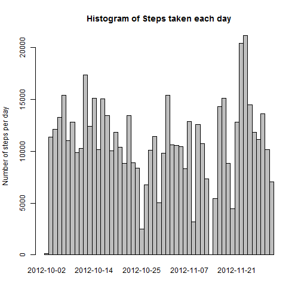
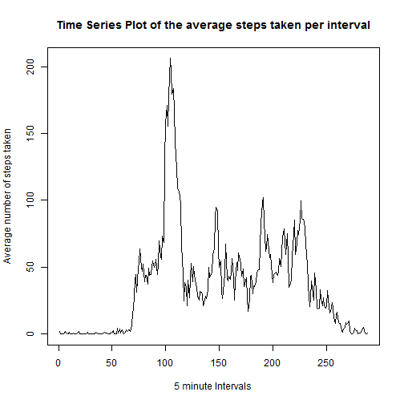
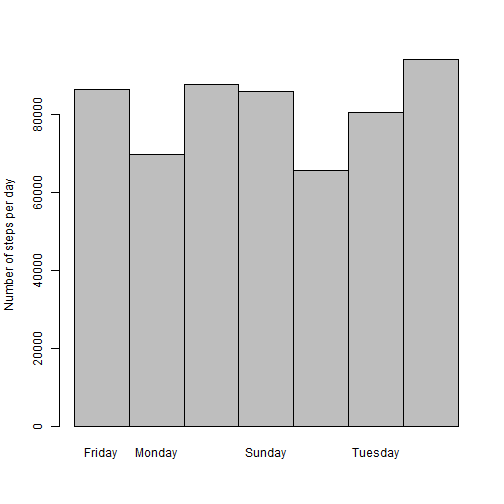

Report 1
========================================================

The data for this project comes from a personal activity monitoring device. I first load the data from an online backup and proceed to preprocess it for analysis.I first remove the NA values and reclassifiy the date column as an R date object. I create an extra variable called Weekdays to help make the analysis simple. 

```r
if (!file.exists("./data")) {
    dir.create("./data")
}
fileurl = "https://d396qusza40orc.cloudfront.net/repdata%2Fdata%2Factivity.zip"
download.file(fileurl, destfile = "./data/data.zip")
```

```
## Error: unsupported URL scheme
```

```r
data = unzip("./data/data.zip")
data = read.csv(data, header = T)

data$date = as.Date(data$date)
data$weekdays = as.factor(weekdays(data$date))
mydata = na.omit(data)
```

### Histogram of Steps taken each day

```r
sums = data.frame(sums = with(mydata, tapply(steps, date, sum)))
barplot(sums$sums, space = F, ylab = "Number of steps per day", main = "Histogram of Steps taken each day")
```

 

The mean and median steps taken each day are listed below.

```r
Means = with(mydata, tapply(steps, date, mean))
Medians = with(mydata, tapply(steps, date, median))
```


```r
Means
```

```
## 2012-10-02 2012-10-03 2012-10-04 2012-10-05 2012-10-06 2012-10-07 
##     0.4375    39.4167    42.0694    46.1597    53.5417    38.2465 
## 2012-10-09 2012-10-10 2012-10-11 2012-10-12 2012-10-13 2012-10-14 
##    44.4826    34.3750    35.7778    60.3542    43.1458    52.4236 
## 2012-10-15 2012-10-16 2012-10-17 2012-10-18 2012-10-19 2012-10-20 
##    35.2049    52.3750    46.7083    34.9167    41.0729    36.0938 
## 2012-10-21 2012-10-22 2012-10-23 2012-10-24 2012-10-25 2012-10-26 
##    30.6285    46.7361    30.9653    29.0104     8.6528    23.5347 
## 2012-10-27 2012-10-28 2012-10-29 2012-10-30 2012-10-31 2012-11-02 
##    35.1354    39.7847    17.4236    34.0938    53.5208    36.8056 
## 2012-11-03 2012-11-05 2012-11-06 2012-11-07 2012-11-08 2012-11-11 
##    36.7049    36.2465    28.9375    44.7326    11.1771    43.7778 
## 2012-11-12 2012-11-13 2012-11-15 2012-11-16 2012-11-17 2012-11-18 
##    37.3785    25.4722     0.1424    18.8924    49.7882    52.4653 
## 2012-11-19 2012-11-20 2012-11-21 2012-11-22 2012-11-23 2012-11-24 
##    30.6979    15.5278    44.3993    70.9271    73.5903    50.2708 
## 2012-11-25 2012-11-26 2012-11-27 2012-11-28 2012-11-29 
##    41.0903    38.7569    47.3819    35.3576    24.4688
```

```r
Medians
```

```
## 2012-10-02 2012-10-03 2012-10-04 2012-10-05 2012-10-06 2012-10-07 
##          0          0          0          0          0          0 
## 2012-10-09 2012-10-10 2012-10-11 2012-10-12 2012-10-13 2012-10-14 
##          0          0          0          0          0          0 
## 2012-10-15 2012-10-16 2012-10-17 2012-10-18 2012-10-19 2012-10-20 
##          0          0          0          0          0          0 
## 2012-10-21 2012-10-22 2012-10-23 2012-10-24 2012-10-25 2012-10-26 
##          0          0          0          0          0          0 
## 2012-10-27 2012-10-28 2012-10-29 2012-10-30 2012-10-31 2012-11-02 
##          0          0          0          0          0          0 
## 2012-11-03 2012-11-05 2012-11-06 2012-11-07 2012-11-08 2012-11-11 
##          0          0          0          0          0          0 
## 2012-11-12 2012-11-13 2012-11-15 2012-11-16 2012-11-17 2012-11-18 
##          0          0          0          0          0          0 
## 2012-11-19 2012-11-20 2012-11-21 2012-11-22 2012-11-23 2012-11-24 
##          0          0          0          0          0          0 
## 2012-11-25 2012-11-26 2012-11-27 2012-11-28 2012-11-29 
##          0          0          0          0          0
```


This is a time series plot of the 5-minute interval and the average number of steps taken, averaged across all days.

```r
Interval = data.frame(Average = with(mydata, tapply(steps, as.factor(interval), 
    mean)))
plot(Interval, type = "l", xlab = "5 minute Intervals", ylab = "Average number of steps taken", 
    main = "Time Series Plot of the average steps taken per interval")
```

 

There are a total of 2304 cases with missing data.

```r
n = nrow(data) - nrow(mydata)
n
```

```
## [1] 2304
```


I use the averages per day to fill in the missing values. So for days where no data was recorded, I put in 0.

```r
Means = with(mydata, tapply(steps, date, mean))
for (i in 1:nrow(data)) {
    if (is.na(data[i, 1])) {
        date = data[i, 2]
        data[i, 1] = Means[date]
    }
    if (is.na(data[i, 1])) {
        data[i, 1] = 0
    }
}
```

This new dataset has missing values filled in using averages for that day.

```r
head(data, n = 10)
```

```
##    steps       date interval weekdays
## 1      0 2012-10-01        0   Monday
## 2      0 2012-10-01        5   Monday
## 3      0 2012-10-01       10   Monday
## 4      0 2012-10-01       15   Monday
## 5      0 2012-10-01       20   Monday
## 6      0 2012-10-01       25   Monday
## 7      0 2012-10-01       30   Monday
## 8      0 2012-10-01       35   Monday
## 9      0 2012-10-01       40   Monday
## 10     0 2012-10-01       45   Monday
```

```r
tail(data, n = 10)
```

```
##       steps       date interval weekdays
## 17559     0 2012-11-30     2310   Friday
## 17560     0 2012-11-30     2315   Friday
## 17561     0 2012-11-30     2320   Friday
## 17562     0 2012-11-30     2325   Friday
## 17563     0 2012-11-30     2330   Friday
## 17564     0 2012-11-30     2335   Friday
## 17565     0 2012-11-30     2340   Friday
## 17566     0 2012-11-30     2345   Friday
## 17567     0 2012-11-30     2350   Friday
## 17568     0 2012-11-30     2355   Friday
```


### Histogram of Steps taken per day of the week

```r
sums = data.frame(sums = with(data, tapply(steps, weekdays, sum)))
barplot(sums$sums, space = F, ylab = "Number of steps per day")
```

 

The mean and median steps taken each day are listed below.

```r
Means = with(data, tapply(steps, date, mean))
Medians = with(data, tapply(steps, date, median))
```


```r
Means
```

```
## 2012-10-01 2012-10-02 2012-10-03 2012-10-04 2012-10-05 2012-10-06 
##     0.0000     0.4375    39.4167    42.0694    46.1597    53.5417 
## 2012-10-07 2012-10-08 2012-10-09 2012-10-10 2012-10-11 2012-10-12 
##    38.2465     0.0000    44.4826    34.3750    35.7778    60.3542 
## 2012-10-13 2012-10-14 2012-10-15 2012-10-16 2012-10-17 2012-10-18 
##    43.1458    52.4236    35.2049    52.3750    46.7083    34.9167 
## 2012-10-19 2012-10-20 2012-10-21 2012-10-22 2012-10-23 2012-10-24 
##    41.0729    36.0938    30.6285    46.7361    30.9653    29.0104 
## 2012-10-25 2012-10-26 2012-10-27 2012-10-28 2012-10-29 2012-10-30 
##     8.6528    23.5347    35.1354    39.7847    17.4236    34.0938 
## 2012-10-31 2012-11-01 2012-11-02 2012-11-03 2012-11-04 2012-11-05 
##    53.5208     0.0000    36.8056    36.7049     0.0000    36.2465 
## 2012-11-06 2012-11-07 2012-11-08 2012-11-09 2012-11-10 2012-11-11 
##    28.9375    44.7326    11.1771     0.0000     0.0000    43.7778 
## 2012-11-12 2012-11-13 2012-11-14 2012-11-15 2012-11-16 2012-11-17 
##    37.3785    25.4722     0.0000     0.1424    18.8924    49.7882 
## 2012-11-18 2012-11-19 2012-11-20 2012-11-21 2012-11-22 2012-11-23 
##    52.4653    30.6979    15.5278    44.3993    70.9271    73.5903 
## 2012-11-24 2012-11-25 2012-11-26 2012-11-27 2012-11-28 2012-11-29 
##    50.2708    41.0903    38.7569    47.3819    35.3576    24.4688 
## 2012-11-30 
##     0.0000
```

```r
Medians
```

```
## 2012-10-01 2012-10-02 2012-10-03 2012-10-04 2012-10-05 2012-10-06 
##          0          0          0          0          0          0 
## 2012-10-07 2012-10-08 2012-10-09 2012-10-10 2012-10-11 2012-10-12 
##          0          0          0          0          0          0 
## 2012-10-13 2012-10-14 2012-10-15 2012-10-16 2012-10-17 2012-10-18 
##          0          0          0          0          0          0 
## 2012-10-19 2012-10-20 2012-10-21 2012-10-22 2012-10-23 2012-10-24 
##          0          0          0          0          0          0 
## 2012-10-25 2012-10-26 2012-10-27 2012-10-28 2012-10-29 2012-10-30 
##          0          0          0          0          0          0 
## 2012-10-31 2012-11-01 2012-11-02 2012-11-03 2012-11-04 2012-11-05 
##          0          0          0          0          0          0 
## 2012-11-06 2012-11-07 2012-11-08 2012-11-09 2012-11-10 2012-11-11 
##          0          0          0          0          0          0 
## 2012-11-12 2012-11-13 2012-11-14 2012-11-15 2012-11-16 2012-11-17 
##          0          0          0          0          0          0 
## 2012-11-18 2012-11-19 2012-11-20 2012-11-21 2012-11-22 2012-11-23 
##          0          0          0          0          0          0 
## 2012-11-24 2012-11-25 2012-11-26 2012-11-27 2012-11-28 2012-11-29 
##          0          0          0          0          0          0 
## 2012-11-30 
##          0
```

I created a new factor variable in the dataset with two levels – “weekday” and “weekend” indicating whether a given date is a weekday or weekend day.I then used this factor variable to create the plot below.

```r
data$week = NA
data$weekdays = as.character(data$weekdays)
for (i in 1:nrow(data)) {
    if (data[i, 4] == "Monday") {
        data[i, 5] = "weekday"
    }
    if (data[i, 4] == "Tuesday") {
        data[i, 5] = "weekday"
    }
    if (data[i, 4] == "Wednesday") {
        data[i, 5] = "weekday"
    }
    if (data[i, 4] == "Thursday") {
        data[i, 5] = "weekday"
    }
    if (data[i, 4] == "Friday") {
        data[i, 5] = "weekday"
    }
    if (data[i, 4] == "Saturday") {
        data[i, 5] = "weekend"
    }
    if (data[i, 4] == "Sunday") {
        data[i, 5] = "weekend"
    }
}

df1 = subset(data, data$week == "weekend")
Interval1 = data.frame(Average = with(df1, tapply(steps, as.factor(interval), 
    mean)), week = "weekend", interval = names(with(df1, tapply(steps, as.factor(interval), 
    mean))))
df2 = subset(data, data$week == "weekday")
Interval2 = data.frame(Average = with(df2, tapply(steps, as.factor(interval), 
    mean)), week = "weekday", interval = names(with(df1, tapply(steps, as.factor(interval), 
    mean))))
df = rbind(Interval1, Interval2)
library(lattice)
```

```
## Warning: package 'lattice' was built under R version 3.0.3
```

```r
df$week = as.factor(df$week)
xyplot(df$Average ~ df$interval | df$week, data = df, type = "l", xlab = "Interval", 
    ylab = "Number of steps", layout = c(1, 2))
```

 


